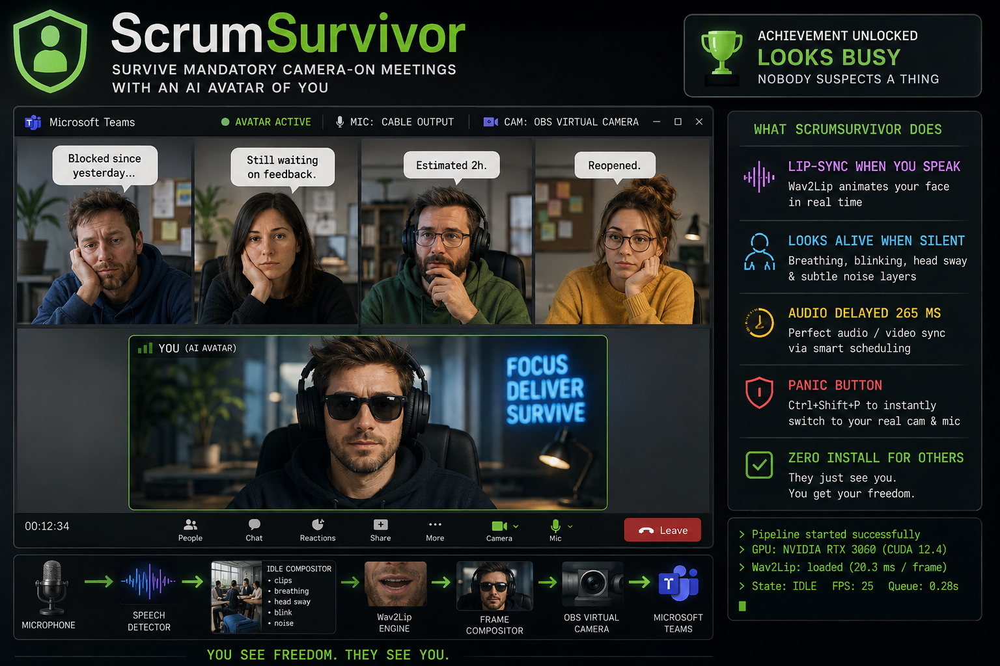

# ScrumSurvivor

[](LICENSE)

> **Survive mandatory camera-on meetings with a photorealistic AI avatar.**



ScrumSurvivor replaces your live webcam feed with an AI-animated version of *you*. When you speak, [Wav2Lip](https://github.com/Rudrabha/Wav2Lip) lip-syncs your face to your voice in real time. When you are silent, the avatar breathes, blinks, sways its head, and plays pre-recorded idle clips — all layered procedurally so it looks alive. Your colleagues see you attentively present. You see freedom.

**Platform:** Windows 10 / 11 · **Primary target:** Microsoft Teams · **GPU required** (NVIDIA CUDA)

---

## Table of Contents

1. [How It Works](#how-it-works)
2. [Requirements](#requirements)
3. [Installation](#installation)
4. [Assets You Must Provide](#assets-you-must-provide)
5. [Full Setup: Step by Step](#full-setup-step-by-step)
6. [Running ScrumSurvivor](#running-scrumsurvivor)
7. [PowerShell Scripts Reference](#powershell-scripts-reference)
8. [CLI Commands Reference](#cli-commands-reference)
9. [Configuration Reference](#configuration-reference)
10. [Panic Button](#panic-button)
11. [Illusion Verifier](#illusion-verifier)
12. [Troubleshooting](#troubleshooting)
13. [Running Tests](#running-tests)
14. [Project Structure](#project-structure)
15. [Acknowledgements](#acknowledgements)

---

## How It Works

```
Microphone ──▶ Speech Detector ──────────────────────────────────────────────────▶ VB-Cable ──▶ Teams (audio)
                                    │  silent                      │  speaking
                                    ▼                              ▼
                             Idle Compositor                Wav2Lip Engine
                       ┌───────────────────────┐       (lip-syncs face crop
                       │  idle video clips     │        to live mic audio,
                       │+ breathing oscillation│        265 ms delayed)
                       │+ head sway (sin sum)  │
                       │+ blink animation      │
                       │+ sensor noise overlay │
                       └───────────────────────┘
                                    │                              │
                                    └──────────────┬───────────────┘
                                                   ▼
                                          Frame Compositor
                                    (overlay avatar on background
                                     + smoothstep crossfade)
                                                   │
                                                   ▼
                                       OBS Virtual Camera ──▶ Teams (video)
```

### Idle state (you are silent)

The pipeline plays randomly selected pre-recorded idle clips of you in your chair, cycling through them with randomised pauses between clips. On top of each clip it applies four independent procedural layers simultaneously:

- **Breathing** — a subtle vertical oscillation of the body region (~0.25 Hz).
- **Head sway** — sum of two independent sinusoids per axis, giving a non-repeating micro-motion.
- **Blink** — fast eyelid-close/reopen animation triggered every 4–8 seconds.
- **Sensor noise** — per-pixel Gaussian noise to simulate a real camera sensor.

All transitions between clips use a smoothstepped crossfade — no visible cuts.

### Speaking state (you are talking)

Speech is detected on the microphone via RMS energy threshold with configurable attack/release hysteresis. When speech is confirmed:

1. The **AudioPresentationScheduler** schedules your microphone audio to arrive at VB-Cable exactly `audio_delay_ms` (default 265 ms) in the future — matching Wav2Lip processing latency so lips and audio are synchronised.
2. Wav2Lip receives a 300×400 px face crop and an 80-bin mel spectrogram window and produces an animated face crop (~20 ms on RTX 3050).
3. The animated crop is composited back into the full frame and sent to the OBS Virtual Camera.

A GPU warmup loop at startup (up to 20 inferences with the real face crop) runs until inference time stabilises below 50 ms before the pipeline accepts audio — preventing first-frame stutter.

### Panic button

`Ctrl+Shift+P` (configurable) instantly switches both the virtual camera **and** audio routing to your real webcam and microphone — bypassing all processing. The webcam is pre-opened in a background thread at startup so the switch is instantaneous.

---

## Requirements

### Software prerequisites

| Requirement | Notes |
|---|---|
| Windows 10 or 11 | Windows-only in v1 |
| Python 3.10+ | [python.org](https://www.python.org/downloads/) — must be in PATH |
| Git | [git-scm.com](https://git-scm.com/) |
| OBS Studio | [obsproject.com](https://obsproject.com/) — open once after install to register the virtual camera driver |
| VB-Audio Virtual Cable | [vb-audio.com/Cable](https://vb-audio.com/Cable/) — install as Administrator, reboot if prompted |
| NVIDIA CUDA driver | Any recent driver supporting CUDA 12+ |

### Hardware requirements

| Component | Minimum | Recommended |
|---|---|---|
| NVIDIA GPU | 4 GB VRAM (RTX 3050 class) | RTX 3060 or better |
| RAM | 8 GB | 16 GB |
| Microphone | Any | Any |
| Webcam | Any | Only needed for asset capture — not used during meetings |

> **No NVIDIA GPU?** The app refuses to start in lipsync mode. CPU-only Wav2Lip inference runs at ~0.5 fps — not usable in real time.

### In Microsoft Teams (configure once)

- **Settings → Devices → Camera** → select **OBS Virtual Camera**
- **Settings → Devices → Microphone** → select **CABLE Output (VB-Audio Virtual Cable)**

---

## Installation

### Step 1 — Clone the repository

```powershell
# Clone the upstream repository
git clone https://github.com/heiner-palmen/ScrumSurvivor.git
cd ScrumSurvivor

# If you forked this repo, clone your fork instead:
# git clone https://github.com/<your-github-username>/ScrumSurvivor.git
# cd ScrumSurvivor
```

### Step 2 — Run the full prerequisites wizard

```powershell
.\run_setup.ps1
```

This automated 7-step wizard:
- Creates the Python virtual environment at `.venv/`
- Installs all pip dependencies from `requirements.txt`
- Detects your CUDA version via `nvidia-smi` and installs the correct CUDA-enabled PyTorch build automatically (e.g. `cu124` for CUDA 12.4)
- Installs the project itself in editable mode (`pip install -e .`)
- Guides you through VB-Cable driver installation
- Verifies OBS Virtual Camera is installed
- Checks for `ffmpeg` and Wav2Lip model weights

> The wizard skips any steps that are already complete. Safe to re-run at any time.

### Step 3 — Download Wav2Lip model weights

Go to the [Wav2Lip releases](https://github.com/Rudrabha/Wav2Lip#getting-the-weights) and download the weights. Place the file at:

```
models/Wav2Lip-SD-NOGAN.pt    ← standard model (recommended)
```

Or the GAN variant (higher quality, slightly more VRAM):

```
models/Wav2Lip-SD-GAN.pt
```

If using the GAN variant, update `config.yaml`:

```yaml
wav2lip_model_path: models/Wav2Lip-SD-GAN.pt
wav2lip_use_gan: true
```

### Step 4 — Create your assets

```powershell
.\run_create_assets.ps1
```

See [Assets You Must Provide](#assets-you-must-provide) for the full requirements.

### Step 5 — Run the configuration wizard

```powershell
.\run_config.ps1
```

This selects your microphone, virtual audio device, and lets you tune the speech detection threshold with a live audio level meter.

### Step 6 — Run

```powershell
.\run.ps1
```

---

## Assets You Must Provide

Before running, you need three types of assets. **All must be captured in the same session, same lighting, same clothing.** Consistency between the base photo and idle clips is what makes the illusion work.

```
assets/
├── base_photo.png        ← Your face + upper body, mouth closed (still image)
├── background.png        ← Empty desk/room background, no people
└── idle_clips/
    ├── blink_01.mp4      ← Blink clips (2 recommended)
    ├── blink_02.mp4
    ├── breathing_01.mp4  ← Natural breathing / settle clip
    └── *.mp4             ← Additional supplemental idle movements (3+ recommended)
```

### Base photo (`assets/base_photo.png`)

| Property | Requirement |
|---|---|
| Format | PNG |
| Resolution | ≥ 1280 × 720 |
| Expression | Neutral, **mouth closed** |
| Framing | Face and shoulders clearly visible |
| Lighting | Even, front-facing — no windows behind you |

### Background image (`assets/background.png`)

Step out of frame, capture your desk from the **exact same camera angle**, save as `assets/background.png`. No people in the shot.

### Idle video clips (`assets/idle_clips/*.mp4`)

Short (5–10 second) MP4 clips of subtle movements. The interactive wizard (`.\run_create_assets.ps1`) guides you through capture with a live preview window.

| Property | Requirement |
|---|---|
| Format | MP4 (H.264) |
| Duration | 5–10 seconds each |
| Mouth | **Closed** — no talking |
| Movements | Subtle — exaggerated movements loop obviously |

Suggested movements: weight shift in chair, brief glance aside, lean forward/back, head tilt, look down at notes, small smile.

> The procedural layers (breathing, blink, head sway, noise) are added *on top*, so clips can be very subtle.

---

## Full Setup: Step by Step

```
 [1]  .\run_setup.ps1          Install all prerequisites + Python environment
 [2]  Place model weights       models/Wav2Lip-SD-NOGAN.pt
 [3]  .\run_create_assets.ps1   Interactive capture: base photo + idle clips
 [4]  .\run_config.ps1          Select mic / virtual audio / tune speech threshold
 [5]  .\run.ps1                 Start the pipeline
```

---

## Running ScrumSurvivor

```powershell
# Normal run
.\run.ps1

# With local preview window (shows what the virtual camera outputs)
.\run.ps1 -Preview

# Without preview window
.\run.ps1 -NoPreview
```

Press `Ctrl+C` in the terminal to stop.

---

## PowerShell Scripts Reference

| Script | Purpose |
|---|---|
| `.\run_setup.ps1` | **One-time** full prerequisites wizard (venv, CUDA torch, drivers, model check) |
| `.\run_create_assets.ps1` | Interactive asset capture wizard (base photo + idle clips) |
| `.\run_config.ps1` | Configuration wizard (microphone, virtual audio, speech threshold) |
| `.\run.ps1` | Start the main pipeline |
| `.\run_verifier.ps1` | Start the Illusion Verifier (A/V sync review tool) |

All scripts automatically activate the `.venv`.

---

## CLI Commands Reference

```powershell
# Direct invocation (venv must be active)
python -m scrumsurvivor <command>
```

| Command | Description |
|---|---|
| `run` | Start the virtual camera pipeline |
| `run --preview` | Start with a local preview window |
| `run --prompt-theme` | Show theme selector at startup |
| `setup` | Interactive configuration wizard |
| `check-gpu` | Print GPU capability report |
| `validate-assets` | Verify all required asset files exist |

All commands accept `--config path/to/config.yaml` to use an alternative config file.

---

## Configuration Reference

`config.yaml` is written by `.\run_config.ps1`. All settings require a restart to take effect.

```yaml
# ── Asset paths ─────────────────────────────────────────────────────────────
base_photo_path: assets/base_photo.png
idle_clips_dir: assets/idle_clips/
wav2lip_model_path: models/Wav2Lip-SD-NOGAN.pt
wav2lip_use_gan: false              # true = GAN variant (higher quality, more VRAM)

# ── Speech detection ─────────────────────────────────────────────────────────
speech_threshold: 0.111             # RMS energy threshold — set by run_config.ps1
speech_attack_ms: 80                # ms of continuous speech before entering SPEAKING state
speech_release_ms: 300              # ms of silence before returning to IDLE state

# ── Audio ────────────────────────────────────────────────────────────────────
audio_delay_ms: 265                 # Delay mic audio to match Wav2Lip processing latency
sample_rate: 48000
microphone_device: 4                # Device index — set by config wizard
virtual_audio_device: "CABLE Input (VB-Audio Virtual Cable) | hostapi=Windows WASAPI | id=27"
output_gain: 0.9

# ── Video output ─────────────────────────────────────────────────────────────
target_fps: 25
output_resolution: [1280, 720]
crossfade_frames: 15                # Smoothstep blend frames between state transitions

# ── Idle animation ────────────────────────────────────────────────────────────
blink_interval_range: [4.0, 8.0]
breathing_clip_interval_range: [10.0, 15.0]
idle_clip_pause_min_s: 3.0
idle_clip_pause_max_s: 5.0
idle_after_speaking_cooldown_s: 3.0

# ── Panic button ─────────────────────────────────────────────────────────────
panic_hotkey: ctrl+shift+p
panic_webcam_device: 1402           # Set automatically at first run
panic_webcam_mirror: true

# ── Preview / logging ────────────────────────────────────────────────────────
preview_enabled: false
log_file: logs/scrumsurvivor.log
log_level: INFO                     # DEBUG, INFO, WARNING, ERROR
```

---

## Panic Button

Press **`Ctrl+Shift+P`** at any time to instantly switch to your real webcam and microphone — all processing is bypassed. The real webcam is pre-opened at startup in a background thread, so the switch happens in a single frame. Press again to return to avatar mode.

The hotkey is configurable via `panic_hotkey` in `config.yaml`.

---

## Illusion Verifier

A separate companion tool for reviewing the audio/video sync of the pipeline output. It records what the virtual camera and VB-Cable are actually sending and saves a file you can review frame by frame.

```powershell
.\run_verifier.ps1
```

Say something or clap while it is running, then press `Ctrl+Shift+F10` (default) to stop. Review the saved recording to check that lip motion and audio are aligned.

---

## Troubleshooting

### Teams does not see OBS Virtual Camera

1. Open OBS Studio and close it — this re-registers the virtual camera driver.
2. In Teams: **Settings → Devices → Camera** → select **OBS Virtual Camera**.
3. Restart Teams after changing the camera setting.

### Teams does not see CABLE Output as microphone

1. Ensure VB-Cable was installed as Administrator and Windows was rebooted.
2. In Teams: **Settings → Devices → Microphone** → select **CABLE Output**.

### Avatar lipsync does not trigger (mouth never moves)

1. Check the log for `State: IDLE → SPEAKING`. If it never appears, the speech threshold is too high. Run `.\run_config.ps1` to re-tune.
2. Check the `queued=X s` value in the log — should be ~0.28 s in normal operation. A permanently growing value indicates a scheduling problem.
3. Confirm PyTorch CUDA is installed: `.\.venv\Scripts\python.exe -c "import torch; print(torch.cuda.is_available())"` must print `True`.

### "GPU insufficient" / lipsync disabled at startup

```powershell
nvidia-smi
.\.venv\Scripts\python.exe -c "import torch; print(torch.version.cuda)"
```

If `torch.version.cuda` prints `None`, the CPU-only PyTorch build is installed. Reinstall:

```powershell
.\.venv\Scripts\pip.exe install torch torchvision torchaudio --index-url https://download.pytorch.org/whl/cu124 --force-reinstall
```

Use `cu121` or `cu118` if your CUDA driver is older (check with `nvidia-smi`).

### "No module named scrumsurvivor"

The package is not installed in the venv:

```powershell
.\.venv\Scripts\pip.exe install -e . --no-deps
```

### Lip sync is delayed or ahead of audio

Re-run the configuration wizard:

```powershell
.\run_config.ps1
```

Or manually adjust `audio_delay_ms` in `config.yaml`. Higher value = audio plays later relative to video.

### Avatar face not detected at startup

MediaPipe could not find a face in `base_photo.png`. Requirements:
- Front-facing face, clearly visible, resolution ≥ 720p, no motion blur
- Run `python -m scrumsurvivor validate-assets` to confirm the file path is correct

---

## Running Tests

```powershell
# Activate venv first
.\.venv\Scripts\Activate.ps1

# All non-hardware tests (no physical devices needed — should always pass)
python -m pytest tests/ -v -m "not hardware and not gpu"

# Hardware tests (requires webcam + VB-Cable connected)
python -m pytest tests/ -v -m hardware

# GPU tests (requires NVIDIA GPU + Wav2Lip model weights)
python -m pytest tests/ -v -m gpu
```

---

## Project Structure

```
ScrumSurvivor/
├── assets/                         ← YOU PROVIDE (base_photo, background, idle clips)
├── models/                         ← YOU DOWNLOAD (Wav2Lip weights)
├── ffmpeg/                         ← ffmpeg.exe binary (placed by run_setup.ps1)
├── src/
│   ├── scrumsurvivor/
│   │   ├── config/                 ← AppConfig dataclass, YAML load/save
│   │   ├── capture/                ← Webcam + microphone capture
│   │   ├── detection/              ← SpeechDetector (RMS) + FaceDetector (MediaPipe)
│   │   ├── idle/                   ← IdleCompositor, breathing/blink/head-sway/noise effects
│   │   ├── lipsync/                ← Wav2LipEngine, AudioPreprocessor, FaceCropManager
│   │   │   └── wav2lip_vendor/     ← Vendored Wav2Lip model architecture (MIT)
│   │   ├── audio/                  ← AudioPresentationScheduler, DuplexAudioTransport
│   │   ├── compositor/             ← FrameCompositor, CrossfadeTransition
│   │   ├── output/                 ← VirtualCamera (pyvirtualcam / OBS)
│   │   ├── app/                    ← Preview window, panic button handler
│   │   ├── pipeline.py             ← Main pipeline state machine + render loop
│   │   ├── cli.py                  ← Click CLI entry point
│   │   └── create_assets.py        ← Interactive asset capture wizard
│   └── illusion_verifier/          ← A/V sync review tool
├── tests/                          ← pytest test suite
├── config.yaml                     ← Written by run_config.ps1
├── pyproject.toml
├── requirements.txt
├── run.ps1                         ← Start the pipeline
├── run_setup.ps1                   ← One-time prerequisites wizard
├── run_create_assets.ps1           ← Interactive asset capture
├── run_config.ps1                  ← Configuration + speech threshold wizard
└── run_verifier.ps1                ← Illusion Verifier (A/V sync review tool)
```

---

## Acknowledgements

Lip synchronisation powered by [Wav2Lip](https://github.com/Rudrabha/Wav2Lip) (Prajwal K R et al., ACM MM 2020). Vendored model architecture used under MIT license with attribution.

## License

ScrumSurvivor is released under the [MIT License](LICENSE).
